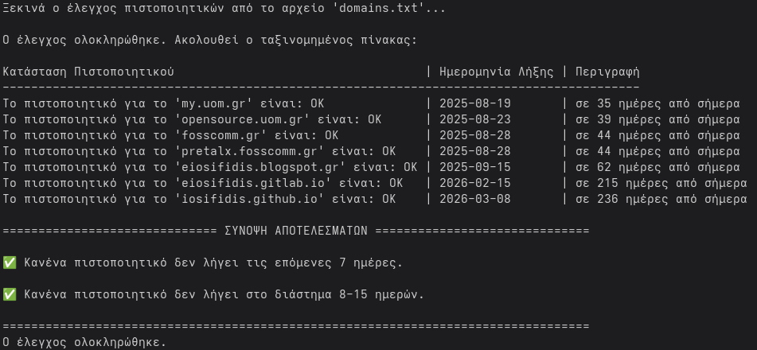

# SSL Certificate Expiration Checker

A simple yet powerful Bash script to check the SSL certificate expiration dates for a list of domains. It presents the results in a clean, sorted table and provides a clear summary of certificates that require attention.

## Features

-   **Bulk Checking**: Checks multiple domains listed in a simple text file.
-   **Real-time Progress**: Displays a progress spinner while checking each domain.
-   **Formatted Table**: Presents results in a clean, auto-aligned, and sorted table for easy readability.
-   **Clear Summary**: Provides a final summary categorized by urgency:
    -   ❌ **Errors**: Domains that could not be checked.
    -   ⚠️ **Critical**: Certificates that have expired or will expire in the next 7 days.
    -   🔔 **Warning**: Certificates that will expire in the next 8-15 days.
-   **Error Handling**: Gracefully handles connection errors and unresolvable domains, listing them in the summary.
-   **Dependency Check**: Verifies that the required `column` command is installed before running.
-   **Configurable**: Easily change the warning day thresholds within the script.

## Prerequisites

Before running the script, ensure you have the following command-line tools installed:

-   `bash`: The shell to run the script.
-   `openssl`: To connect to servers and inspect certificates.
-   `coreutils`: Provides standard commands like `date`, `sort`, `cut`, etc. (The script relies on GNU `date` for date parsing).
-   `timeout`: To prevent the script from hanging on unresponsive domains.
-   `column`: For formatting the output into a table.

On most systems, only `column` might be missing. The script will check for it and provide installation instructions.

**To install `column`:**
-   **Debian / Ubuntu:**
    ```sh
    sudo apt-get update && sudo apt-get install bsdmainutils
    ```
-   **CentOS / Fedora / RHEL:**
    ```sh
    sudo yum install util-linux
    # or
    sudo dnf install util-linux
    ```

## Setup

1.  **Save the Script**
    Save the script content to a file named `check_ssl.sh`.

2.  **Make it Executable**
    Open your terminal and grant execute permissions to the script:
    ```sh
    chmod +x check_ssl.sh
    ```

3.  **Create the Domain List**
    In the same directory, create a file named `domains.txt`. Add the domains you want to check, one per line.

    **Example `domains.txt`:**
    ```
    # --- Major Websites ---
    google.com
    github.com
    
    # --- My Projects ---
    my-awesome-project.com
    another-cool-site.dev
    
    # --- Test Cases ---
    expired.badssl.com
    untrusted-root.badssl.com
    ```
    *Note: Lines starting with `#` and empty lines are ignored.*

## Usage

Simply run the script from your terminal:

```sh
./check_ssl.sh
```

The script will start checking the domains listed in `domains.txt` and will print the progress, the results table, and the final summary.

## Example Output

```
Starting certificate check from file 'domains.txt'...

[|] Checking 4/4: untrusted-root.badssl.com...
Check complete. Here is the sorted table:

Κατάσταση Πιστοποιητικού                                  | Ημερομηνία Λήξης | Περιγραφή
----------------------------------------------------------|------------------|--------------------------------
The certificate for 'expired.badssl.com' is: HAS EXPIRED  | 2015-04-12       | expired 2815 days ago
The certificate for 'my-awesome-project.com' is: URGENT   | 2024-09-12       | in 6 days from now
The certificate for 'another-cool-site.dev' is: WARNING   | 2024-09-20       | in 14 days from now
The certificate for 'google.com' is: OK                   | 2024-11-18       | in 73 days from now
The certificate for 'github.com' is: OK                   | 2025-06-04       | in 272 days from now

============================== RESULTS SUMMARY ==============================

❌ ERRORS ENCOUNTERED DURING CHECK:
  - Could not connect or retrieve certificate for 'untrusted-root.badssl.com'.

⚠️ CERTIFICATES EXPIRING IN THE NEXT 7 DAYS (or have expired):
  - expired.badssl.com: HAS EXPIRED (expired 2815 days ago, 2015-04-12)
  - my-awesome-project.com: URGENT (in 6 days from now, 2024-09-12)

🔔 CERTIFICATES EXPIRING IN 8-15 DAYS:
  - another-cool-site.dev: WARNING (in 14 days from now, 2024-09-20)

==================================================================================
Check completed.
```



## Configuration

You can customize the script's behavior by editing the variables at the top of the file:

-   `DOMAINS_FILE`: Change the name of the input file for domains.
    ```bash
    DOMAINS_FILE="production_servers.txt"
    ```
-   `WARN_DAYS_7`: Set the threshold (in days) for "Urgent" warnings.
    ```bash
    WARN_DAYS_7=10 # Warn for certs expiring in 10 days or less
    ```
-   `WARN_DAYS_15`: Set the threshold (in days) for standard "Warnings".
    ```bash
    WARN_DAYS_15=30 # Warn for certs expiring in 11-30 days
    ```
